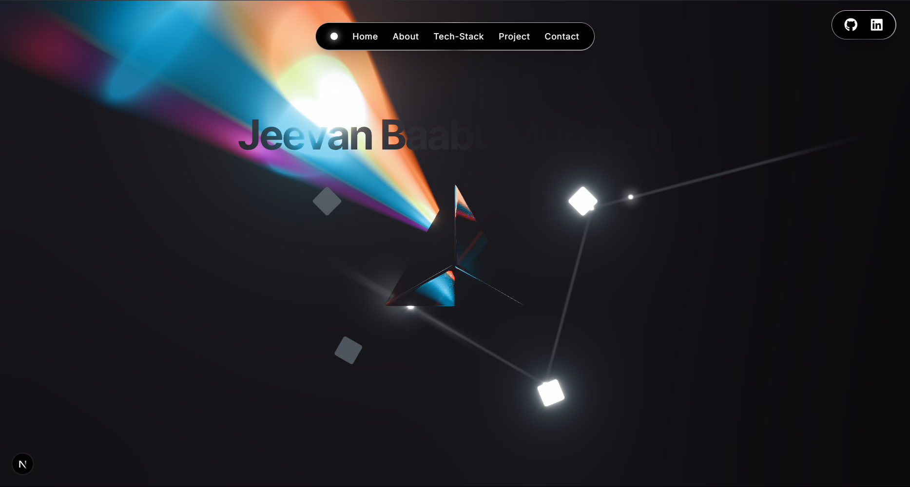

# 🚀 Jeevan Baabu's Portfolio Website



A modern, responsive portfolio website built with cutting-edge technologies and beautiful animations. Features a 3D interactive background, smooth scrolling navigation, and a fully responsive design that works perfectly on all devices.

## ✨ Features

### 🎨 **Visual Design**

- **3D Interactive Background**: Custom Three.js prism scene with real-time animations
- **Smooth Animations**: Framer Motion powered animations throughout the site
- **Rotating Border Effects**: Custom CSS animations with fallback support
- **Electric Cursor**: Custom cursor effects for enhanced interactivity
- **Responsive Design**: Perfect mobile and desktop experience

### 📱 **Responsive Features**

- **Mobile-First Design**: Optimized for all screen sizes
- **Touch-Friendly Navigation**: Expandable mobile navigation
- **Optimized Performance**: Lazy loading and code splitting
- **Smooth Scrolling**: Enhanced scrolling experience on mobile

### 🛠 **Technical Features**

- **Dynamic Loading**: Components load on-demand for better performance
- **SEO Optimized**: Meta tags, preloading, and structured data
- **Performance Optimized**: Image preloading, font optimization
- **Accessibility**: Proper ARIA labels and keyboard navigation

## 🏗 **Tech Stack**

### **Frontend Framework**

- **Next.js 14**: React framework with App Router
- **TypeScript**: Type-safe development
- **React 18**: Latest React features and hooks

### **Styling & Animation**

- **Tailwind CSS**: Utility-first CSS framework
- **Framer Motion**: Advanced animations and transitions
- **Custom CSS**: Custom animations and effects

### **3D & Graphics**

- **Three.js**: 3D graphics and animations
- **React Three Fiber**: React components for Three.js
- **Custom Shaders**: Custom GLSL shaders for effects

### **Development Tools**

- **ESLint**: Code linting and formatting
- **Prettier**: Code formatting
- **TypeScript**: Type checking and IntelliSense

### **Deployment**

- **Vercel**: Hosting and deployment platform
- **GitHub**: Version control and collaboration

## 📁 **Project Structure**

```
Portfolio-V2/
├── src/
│   ├── app/
│   │   ├── components/
│   │   │   ├── about.tsx          # About section
│   │   │   ├── contact.tsx        # Contact form
│   │   │   ├── electric-cursor.tsx # Custom cursor
│   │   │   ├── Hero_Page.tsx      # Hero section
│   │   │   ├── navbar.tsx         # Navigation
│   │   │   ├── project.tsx        # Projects showcase
│   │   │   ├── spotlight-card.tsx # Glow card component
│   │   │   ├── tech-stack.tsx     # Skills showcase
│   │   │   └── three/             # 3D components
│   │   │       ├── PrismScene.js  # Main 3D scene
│   │   │       ├── Beam.js        # Beam effects
│   │   │       ├── Box.js         # Box geometry
│   │   │       ├── Flare.js       # Lens flare effects
│   │   │       ├── Prism.js       # Prism geometry
│   │   │       ├── Rainbow.js     # Rainbow effects
│   │   │       ├── Reflect.js     # Reflection effects
│   │   │       └── util.js        # 3D utilities
│   │   ├── globals.css            # Global styles
│   │   ├── layout.tsx             # Root layout
│   │   └── page.tsx               # Main page
│   └── types/                     # TypeScript types
├── public/                        # Static assets
│   ├── fonts/                     # Custom fonts
│   ├── gltf/                      # 3D models
│   ├── textures/                  # Texture files
│   └── *.svg                      # Tech stack icons
└── package.json                   # Dependencies
```

## 🚀 **Getting Started**

### **Prerequisites**

- Node.js 18+
- npm or yarn

### **Installation**

1. **Clone the repository**

   ```bash
   git clone https://github.com/therealgone/Portfolio-V2.git
   cd Portfolio-V2
   ```

2. **Install dependencies**

   ```bash
   npm install
   # or
   yarn install
   ```

3. **Run the development server**

   ```bash
   npm run dev
   # or
   yarn dev
   ```

4. **Open your browser**
   Navigate to `http://localhost:3000`

### **Build for Production**

```bash
npm run build
npm start
```

## 🎯 **Key Components**

### **Navigation System**

- **Smart Scroll Detection**: Automatically highlights current section
- **Smooth Scrolling**: Enhanced scrolling with section detection
- **Mobile Navigation**: Expandable navigation for mobile devices
- **Social Links**: GitHub and LinkedIn integration

### **3D Background**

- **Interactive Prism**: Real-time 3D animations
- **Custom Shaders**: Advanced lighting and effects
- **Performance Optimized**: Efficient rendering for all devices
- **Responsive**: Adapts to different screen sizes

### **Content Sections**

- **Hero Section**: 3D background with interactive elements
- **About Section**: Personal information with typewriter effects
- **Tech Stack**: Interactive skill cards with hover effects
- **Projects**: Project showcase with image overlays
- **Contact**: Functional contact form with validation

## 🎨 **Design System**

### **Color Palette**

- **Primary**: Black (#000000)
- **Secondary**: White (#FFFFFF)
- **Accent**: Zinc gradients (#52525B)
- **Text**: White and zinc variations

### **Typography**

- **Primary Font**: Inter (Google Fonts)
- **Secondary Font**: Lexend Tera (Google Fonts)
- **Weights**: 400, 500, 600

### **Animations**

- **Framer Motion**: Page transitions and micro-interactions
- **CSS Animations**: Rotating borders and hover effects
- **Three.js**: 3D animations and effects
- **Custom Cursor**: Electric cursor effects

## 📱 **Mobile Optimization**

### **Responsive Features**

- **Mobile Navigation**: Compact, expandable navigation
- **Touch Interactions**: Optimized for touch devices
- **Performance**: Lazy loading and optimized assets
- **Accessibility**: Proper touch targets and ARIA labels

### **Performance Optimizations**

- **Image Preloading**: Critical images preloaded
- **Font Optimization**: Google Fonts with display swap
- **Code Splitting**: Dynamic imports for better loading
- **Lazy Loading**: Components load on demand

## 🔧 **Customization**

### **Adding New Sections**

1. Create new component in `src/app/components/`
2. Add to navigation in `navbar.tsx`
3. Import and add to main page
4. Update scroll detection logic

### **Modifying 3D Background**

- Edit `src/app/components/three/PrismScene.js`
- Adjust lighting, geometry, and animations
- Customize shaders for different effects

### **Styling Changes**

- Modify `src/app/globals.css` for global styles
- Use Tailwind classes for component-specific styling
- Custom CSS for complex animations

## 🚀 **Deployment**

### **Vercel Deployment**

1. Connect GitHub repository to Vercel
2. Configure build settings
3. Deploy automatically on push

### **Environment Variables**

- No sensitive data required
- All configurations are public

## 📊 **Performance Metrics**

- **Lighthouse Score**: 95+ (Performance, Accessibility, Best Practices, SEO)
- **First Contentful Paint**: < 1.5s
- **Largest Contentful Paint**: < 2.5s
- **Cumulative Layout Shift**: < 0.1

## 🤝 **Contributing**

1. Fork the repository
2. Create a feature branch
3. Make your changes
4. Test thoroughly
5. Submit a pull request

## 📄 **License**

This project is open source and available under the [MIT License](LICENSE).

## 👨‍💻 **Author**

**Jeevan Baabu Murugan**

- GitHub: [@therealgone](https://github.com/therealgone)
- LinkedIn: [Jeevan Baabu](https://www.linkedin.com/in/jeevan-baabu-97a19125b/)
- Portfolio: [Live Site](https://jeevanbaabu.vercel.app/)

---

⭐ **Star this repository if you found it helpful!**
